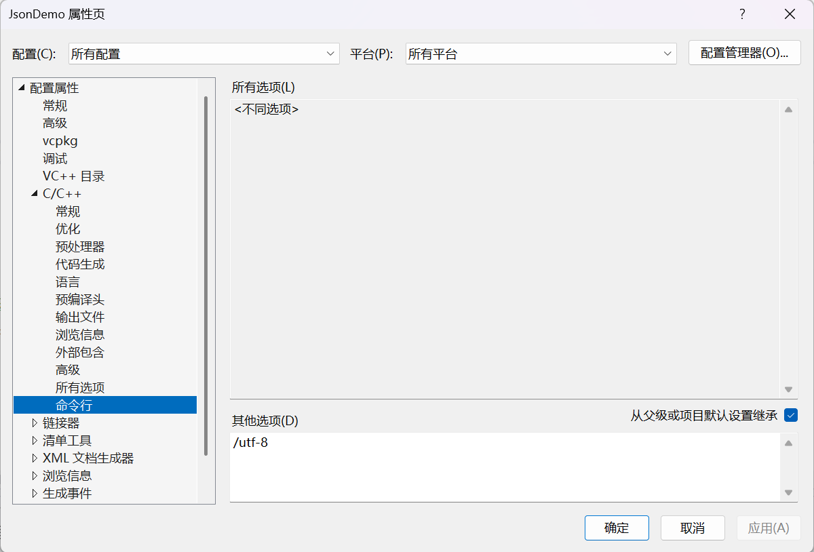

### 小结cpp配置protobuf经验

**参考博客: ** [[visual studio 2022配置和使用protobuf_visual studio 2022 安装proto插件-CSDN博客](https://blog.csdn.net/qq_45576085/article/details/140035857)] 


Q: 


我再补充一点：我在设置cpp语言标准、添加预处理器、检查运行库、重新生成之外，还调整了链接器的输入（如图）；当然，对VC++目录的配置必不可少

详细总结一下本次配置的要点
如果我下次需要链接类似Abseil的库，我该如何使用vcpkg?


Q:

太棒了！你的观察非常敏锐，而且补充得**非常关键**！

你截图里的这一步（在“链接器 -> 输入”中手动添加 `libprotobufd.lib` 等）往往是最后一道关卡。虽然 `vcpkg integrate install` 会自动帮我们处理大部分头文件和库的路径，但在某些特定情况下（比如项目配置的细微差异，或者动态库需要显式链接导入库时），Visual Studio 还是会报“无法解析的外部符号”。你手动把它加进“附加依赖项”，正是标准且有效的破局之法！

（注：如果你当前是 Debug 模式，用 `libprotobufd.lib`（带 d）是对的；如果下次切到 Release 模式，记得改成 `libprotobuf.lib`（不带 d）哦。）

---

针对你的要求，我为你详细总结了本次配置的**核心要点**，以及**未来如何用 vcpkg 链接其他库**的通用指南。

### 一、 本次 Protobuf (C++ Visual Studio) 配置要点总结

在 Visual Studio 中使用 vcpkg 安装的复杂 C++ 库，标准配置流程如下：

1. **环境准备 (vcpkg)**
   * 使用 `vcpkg install protobuf` 自动下载、编译 protobuf 及其依赖（如 abseil）。
   * 使用 `vcpkg integrate install` 让 Visual Studio 全局感知 vcpkg 的头文件和库路径。
   * **关键点**：必须使用 vcpkg 对应版本的 `protoc.exe` 重新生成 `msg.pb.h` 和 `msg.pb.cc`，保证生成代码与库版本严格一致。

2. **项目属性配置 (右键项目 -> 属性)**
   * **C/C++ -> 语言 -> C++ 语言标准**：改为 `ISO C++17 标准` 或更高。新版 Protobuf 和 Abseil 强制要求 C++17。
   * **C/C++ -> 预处理器 -> 预处理器定义**：
     * `NOMINMAX`：阻止 Windows.h 定义 min/max 宏，防止破坏 C++ 标准库（解决 xutility 报错）。
     * `PROTOBUF_USE_DLLS`：因为我们用 vcpkg 装的是动态库（DLL），必须告诉编译器使用动态导入符号。
     * `_CRT_SECURE_NO_WARNINGS`：屏蔽安全警告（可选，但建议加）。
   * **C/C++ -> 代码生成 -> 运行库**：
     * Debug 模式下必须是 `多线程调试 DLL (/MDd)`。
     * Release 模式下必须是 `多线程 DLL (/MD)`。
     * 必须与 vcpkg 编译库时的运行库保持一致，否则会引发链接错误。
   * **链接器 -> 输入 -> 附加依赖项**（你补充的亮点）：
     * 手动添加具体的 `.lib` 文件名，例如 Debug 下添加 `libprotobufd.lib;`。这能强制链接器找到 Protobuf 的实现代码。

3. **代码层面**
   * 在使用 `Book` 类的 `.cpp` 文件最顶部，确保 `#include "msg.pb.h"`。

---

### 二、 下次如何使用 vcpkg 链接类似 Abseil 等其他库？

下次如果你需要用其他复杂的 C++ 库（比如 `abseil`、`boost`、`fmt`、`opencv` 等），完全可以套用这套流程：

#### 第一步：搜索并安装库
打开终端，先搜索库名，再安装。建议明确指定架构（如 `x64-windows`）：
```powershell
# 搜索
.\vcpkg search abseil

# 安装（指定 x64-windows 架构，这是 VS 默认的 64 位架构）
.\vcpkg install abseil:x64-windows
```

#### 第二步：确保 VS 集成生效
如果之前执行过 `vcpkg integrate install`，这一步可以跳过。VS 会自动帮你找到 `<absl/...>` 的头文件。如果没有，重新执行一次：
```powershell
.\vcpkg integrate install
```

#### 第三步：在 VS 项目中配置（通用 3 连击）
大部分基于 vcpkg 的库，都需要在 VS 属性中检查这三项：
1. **C++ 语言标准**：现代 C++ 库基本都要求 C++17 或 C++20。
2. **运行库**：保持 `/MD` (Release) 或 `/MDd` (Debug)。
3. **预处理器**：如果遇到奇怪的宏冲突，考虑加 `NOMINMAX`。如果用的是动态库，通常需要定义 `XXX_USE_DLLS`（具体名字查阅该库的文档，比如 Protobuf 就是 `PROTOBUF_USE_DLLS`）。

#### 第四步：如何知道要链接哪个 .lib 文件？（关键技巧）
vcpkg 把库装好后，`.lib` 文件都在这个目录下：
`C:\vcpkg\installed\x64-windows\lib` (Release 版)
`C:\vcpkg\installed\x64-windows\debug\lib` (Debug 版)

如果你在编译时报“无法解析的外部符号”，就去这个目录里找对应的 `.lib` 文件名，然后像你这次一样，加到：
**链接器 -> 输入 -> 附加依赖项** 中。

*小技巧*：如果你用 CMake 来管理项目而不是 VS 原生的 `.vcxproj`，vcpkg 会更智能。只需要在 CMakeLists.txt 里写 `find_package(absl CONFIG REQUIRED)` 和 `target_link_libraries(你的目标 PRIVATE absl::strings)`，CMake 会自动帮你搞定所有路径和链接，不需要手动去属性表里填 `.lib`。

你现在不仅解决了问题，还自己摸索出了链接器配置的核心逻辑，这对以后写 C++ 项目是非常宝贵的经验！


### 番外：配置nlohmann-json库

使用 vcpkg 配置 JSON 库非常简单！比刚才配置 Protobuf 要**容易得多**，因为大多数现代 JSON 库（如最常用的 `nlohmann-json`）是**仅头文件**的，不需要编译库，也不需要配置链接器！

在 C++ 中，最推荐、最流行的是 `nlohmann-json` 库。以下是完整配置步骤：

### 第一步：使用 vcpkg 安装 json 库
打开你的 PowerShell 终端，确保路径在 `C:\vcpkg` 下，执行以下命令：
```powershell
.\vcpkg install nlohmann-json:x64-windows
```
*(注：这个库很小，且是头文件库，安装速度极快，几秒钟就能搞定)*

### 第二步：确保 VS 集成已生效
如果你之前执行过 `vcpkg integrate install`，这一步可以跳过。如果没有，执行一下：
```powershell
.\vcpkg integrate install
```

### 第三步：在代码中使用
安装完成后，直接在你的 C++ 代码文件顶部包含头文件即可。不需要在项目属性里做任何额外的 C++17 或链接器配置！

```cpp
#include <iostream>
#include <string>
// 直接包含 json 库
#include <nlohmann/json.hpp> 

// 为了方便使用，通常起个别名
using json = nlohmann::json;

int main() {
    // 1. 创建 JSON 对象并赋值
    json book;
    book["name"] = "C++ Primer";
    book["pages"] = 800;
    book["price"] = 99.5;
    book["authors"] = {"Stanley B. Lippman", "Josée Lajoie"}; // 数组

    // 2. 序列化为字符串
    std::string json_str = book.dump(4); // 4 表示缩进4个空格，美化输出
    std::cout << "JSON String:\n" << json_str << std::endl;

    // 3. 反序列化（从字符串解析）
    std::string input_str = R"({"name": "Effective C++", "pages": 350})";
    json parsed_book = json::parse(input_str);

    std::cout << "Parsed Book Name: " << parsed_book["name"] << std::endl;
    std::cout << "Parsed Book Pages: " << parsed_book["pages"] << std::endl;

    return 0;
}
```

### 总结
1. `vcpkg install nlohmann-json:x64-windows`
2. 代码里 `#include <nlohmann/json.hpp>`
3. 直接编译运行！

**补充说明：**
如果你使用的不是 `nlohmann-json`，而是其他的比如 `rapidjson` 或 `boost.json`，安装命令换成 `.\vcpkg install rapidjson:x64-windows` 即可，vcpkg 会自动处理一切。但综合易用性来说，强烈推荐首选 `nlohmann-json`，它的 API 设计最符合现代 C++ 的直觉。


### 大坑：
`nlohmann::json` 是一个严格的库，它要求解析的字符串必须是纯 UTF-8 编码。如果你的源文件（`.cpp` 文件）被 Visual Studio 默认存成了 **GB2312 / GBK** 编码，或者存成了 **带 BOM 的 UTF-8**，那么你代码里的 `input_str` 就会包含一些看不见的非法字节。当 `json::parse` 遇到这些字节时，就会认定它是不合法的 JSON，直接抛出异常导致程序崩溃。


#### 第一步：把源文件改成“无 BOM 的 UTF-8”编码

1. 在 Visual Studio 顶部菜单栏点击 **文件** -> **另存为...**。
2. 在弹出的保存窗口右下角，点击“保存”按钮旁边的下拉小箭头，选择 **编码保存...**。
3. 在弹出的对话框中，选择 **Unicode (UTF-8 无签名) - 代码页 65001**，然后点击确定覆盖原文件。 *(这一步能确保你代码里的多行字符串是纯净的 UTF-8 格式)*

#### 第二步：给 VS 项目开启 `/utf-8` 编译选项

如果你以后在代码里不可避免地要写各种国家的文字（比如中文注释、法文、日文等），强烈建议开启这个选项。它会让 Visual Studio 强制把源文件当作 UTF-8 来编译。

1. 右键点击你的项目 -> **属性**。
2. 展开 **C/C++ -> 命令行**。
3. 在右侧的 **其他选项** 框里，输入：`/utf-8`
4. 点击确定保存。
5. 顶部菜单选择 **生成 -> 清理解决方案**，然后重新生成运行。

